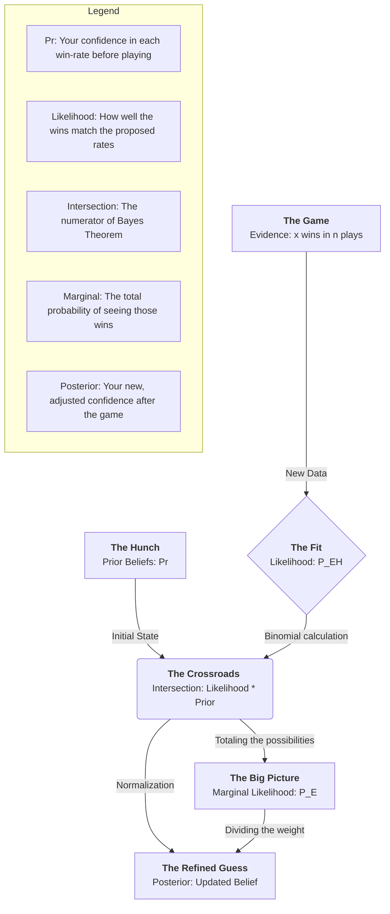

## Bayesian Probability

## 0-likelihood.py

## 1-intersection.py

## 2-marginal.py

## 3-posterior.py

Imagine: **The Arcade Detective: Uncovering the Machine's Secret**

You are at an arcade with a machine that gives out tickets. You have a set of hypothetical win rates (P) and a hunch (Pr) about which one is true. You play n rounds and win x times.

The posterior is indeed an array with the same shape as P (the hypothetical probabilities) and Pr (the prior beliefs).
Based on the sources and your code, here is why that is the case:

#### 1. Representing a "Distribution"

Bayesian statistics treats unknown parameters (like your win rates in `P`) as random variables that are modeled using a probability distribution.

Your array `Pr` is the "Prior Distribution"—it assigns a belief to every possible value in `P`.

_The goal of Bayes' Theorem **in this context** is to update that entire distribution._

Therefore, the result must be a new array (the **Posterior Distribution**) where each element represents the updated belief for its corresponding hypothesis in `P`.

#### 2. The Logic of the Calculation

Posterior **is proportional** to the product of the `likelihood` and the prior.

The **Intersection** (Array): When you multiply the `likelihood` array by the prior array `Pr`, you get an array where each element is the product $$P(E∣H i )×P(H i)$$ for every hypothesis $$i$$.

The Marginal `scalar`: The "marginal probability" or "evidence" is the **sum of all those individual intersections**. This is a single number (a scalar) that represents the total probability of seeing the data across all hypotheses.

The **Normalization**: When you divide the Intersection array by the Marginal scalar, you are simply "scaling" the values so they sum to 1. This operation does not change the shape of the array; it only updates the values within it.

#### 3. Summary of Shapes

- P: 1D Array (Hypothetical win rates)
- Pr: 1D Array (Initial confidence in those rates)
- Intersection: 1D Array (Likelihood × Prior for each rate)
- Marginal: Scalar (The sum of the intersection array)
- Posterior: 1D Array (The intersection array divided by the marginal sum)

Wrapping up: "the `posterior` is proportional to this product [of `prior` and `likelihood`]". By keeping the array structure, your posterior function allows you to see how your belief has shifted for every individual win rate you were considering

## 100-continuous.py

