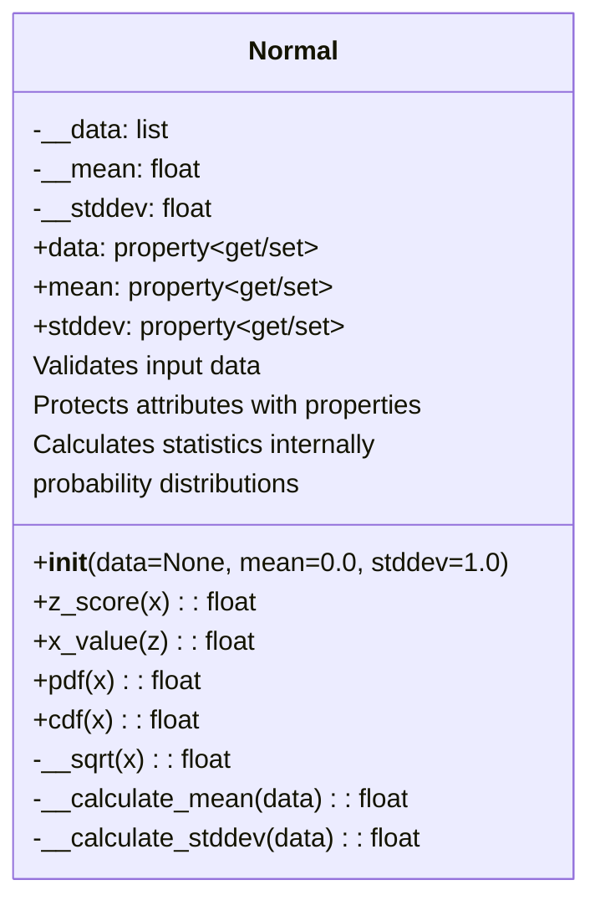
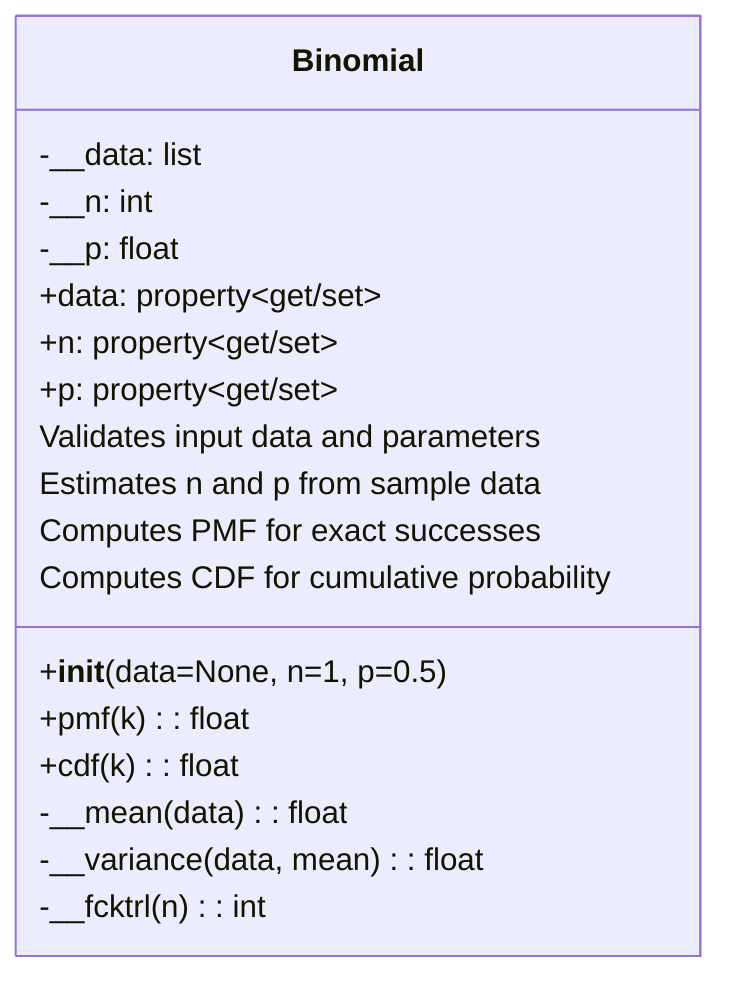

poisson.py

exponential.py

normal.py

```mermaid
classDiagram
    class Normal {
        -__data: list
        -__mean: float
        -__stddev: float
        
        +__init__(data=None, mean=0.0, stddev=1.0)

        +z_score(x): float
        +x_value(z): float
        +pdf(x): float
        +cdf(x): float
        
        +data: property~get/set~
        +mean: property~get/set~
        +stddev: property~get/set~
        
        -__sqrt(x): float
        -__calculate_mean(data): float
        -__calculate_stddev(data): float
    }
    
    Normal : Validates input data
    Normal : Protects attributes with properties
    Normal : Calculates statistics internally
    Normal : probability distributions
```

binomial.py

```mermaid
classDiagram
    class Binomial {
        -__data: list
        -__n: int
        -__p: float
        
        +__init__(data=None, n=1, p=0.5)

        +pmf(k): float
        +cdf(k): float
        
        +data: property~get/set~
        +n: property~get/set~
        +p: property~get/set~
        
        -__mean(data): float
        -__variance(data, mean): float
        -__fcktrl(n): int
    }
    
    Binomial : Validates input data and parameters
    Binomial : Estimates n and p from sample data
    Binomial : Computes PMF for exact successes
    Binomial : Computes CDF for cumulative probability
```
