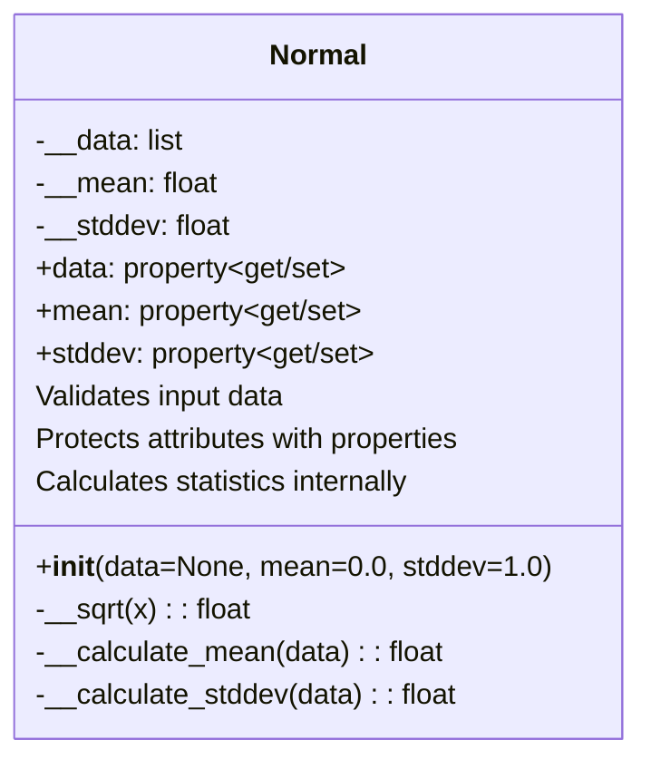

poisson.py

exponential.py

normal.py

```mermaid
classDiagram
    class Normal {
        -__data: list
        -__mean: float
        -__stddev: float
        
        +__init__(data=None, mean=0.0, stddev=1.0)
        
        +data: property~get/set~
        +mean: property~get/set~
        +stddev: property~get/set~
        
        -__sqrt(x): float
        -__calculate_mean(data): float
        -__calculate_stddev(data): float
    }
    
    Normal : Validates input data
    Normal : Protects attributes with properties
    Normal : Calculates statistics internally
```
