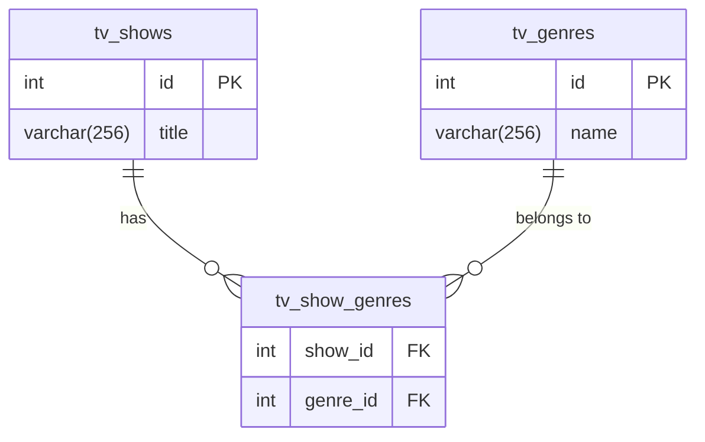

# Database hbtn_0d_tvshows Documentation

This database contains information about TV shows and their associated genres. It uses a many-to-many relationship structure.

## Entity-Relationship Diagram

